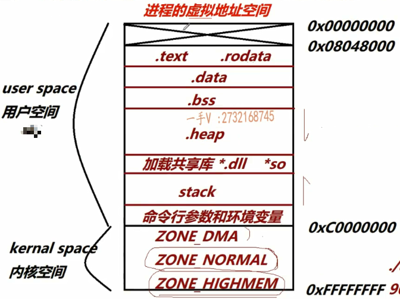
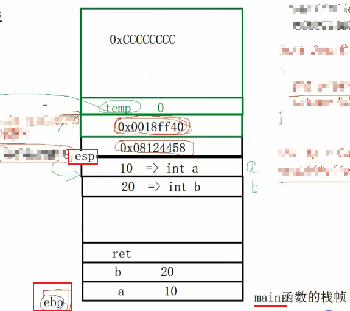

## 进程虚拟地址空间区域的划分和布局

数据和指令在程序运行时，放在内存的什么位置？

```cpp
int gdata1 = 10; // 初始化不为0
int gdata2 = 0; // 初始化为0
int gdata3; // 未初始化

static int gdata4 = 20;
static int gdata5 = 0;
static int gdata6;

int main() {
    int a = 30;
    int b = 0;
    int c;
    
    static int e = 40;
    static int f = 0;
    static int g;
    
    return 0;
}
```

==上述代码编译、链接，产生可执行文件后，运行时，数据和指令放在内存的什么位置？==

> 任何编程语言，最终都是**指令**和**数据**

代码经过编译链接后得到可执行文件，放在磁盘上，当运行时：

首先，将程序从磁盘上加载到内存中，不可能直接加载到物理内存中

> - 将可执行程序的哪些内容加载到内存中？
> - 加载到内存中如何存放？
> - 内存有没有区域的划分？
> - 划分后是什么样子的？

- Linux系统内核会给当前进程，分配一个$2^{32}byte$即4GB大小的空间，这块空间就是**进程的==虚拟==地址空间**。（基于X86架构32位Linux系统，在32位的架构中，地址总线的宽度为 32 位，这意味着可以表达的地址范围是$2^{32}$，每个地址通常表示 1 字节，因此可以寻址的最大范围为$2^{32}$字节）

> IBM关于虚拟的定义：
>
> 它存在，你看得见，它是**物理**的；
>
> 它存在，你看不见，它是**透明**的；
>
> 它不存在，你却看得见，它是**虚拟**的；
>
> 它不存在，你也看不见，它被**删除**了

==每个进程都有一个这样的虚拟地址空间==。每个进程的用户空间是**私有的**，但是内核空间是**共享的**，因此如果创建多个进程，内核空间由这些进程共享，进程间通信的管道通信就是利用了这一特性，虽然不同进程间用户空间是隔离的，但是内核空间是共享的

虚拟地址空间（地址由低到高）包含：



- 用户空间(user space) —— $3G:0x0000,0000\sim0xB000,0000$，用户空间是为用户进程提供的虚拟地址范围，占虚拟地址空间的 **低 3GB**。

    - $0x0000,0000\sim0x0804,8000$：用户空间并没有直接从`零地址`开始存放，而是从`0x0804,8000`开始存放，前面预留的部分是不能访问的。`nullptr`就表示零地址

    - 代码段（Text Segment）`.text`

        从较低地址开始，一般从 `0x08048000`（ELF 可执行文件的默认起始地址），结束位置**动态调整**

        在程序运行时，指令就放在内存的这块区域，即存放程序的可执行代码（只读，防止修改代码）

    - 只读数据段（Read-Only Data Segment）`.rodata`

        位置紧接代码段之后，具体由编译器和链接器决定

        位于代码段和数据段之间，专门存放**不可修改的常量数据**，例如字符串常量（例如：`"Hello, World!"`）和 `const` 修饰的全局变量或静态变量（如 `const int x = 42;`）以及编译器认为不可修改的其他数据。

        编译器会将相同的字符串常量合并到只读数据段中，减少冗余，提高效率

        - 该段通常被标记为**只读（Read-Only）**，防止程序运行时意外修改。
        - 如果尝试修改，会导致运行时错误（如 `segmentation fault`）。

        ```cpp
        char *p = "hello"; // hello 就在rodata
        *p = 'a'; // 可编译，运行时报错
        // 新的c++编译器，不运行用普通指针指向常量字符串
        const char *p = "hello";
        ```

        `.text`和`.rodata`不允许写，只能读

    - 数据段（Data Segment）`.data`

        位于只读数据段之后，大小会动态调整

        用于存放已初始化的全局变量和静态变量，而且初始化值不为0。可读写

    - BSS段（Block Started by Symbol Segment）`.bss`

        也叫数据段，位置紧接数据段之后，具体的地址范围动态调整

        用于存放未初始化的全局变量和静态变量，以及初始化为0的。对于未初始化的数据，在运行时初始化为 0。

        在程序运行时，内核给当前的进程分配地址空间，把程序的未初始化的数据放在BSS段，内核会将这里的数据全部置0。BSS段仅在运行时占用内存。

    - 堆段（Heap Segment）`.heap`

        只有程序运行时，调用的`new`或`malloc`才会分配堆内存，用于存放动态分配的内存

        因此它的范围是从 BSS 段结束的位置开始，向高地址增长。具体的地址范围动态调整

    - **共享库映射**

        当前程序在运行过程中，会加载一些共享库，也就是动态链接库。win上是`.dll`，Linux下是`.so`库，都会映射到这一部分的虚拟地址空间

        它的范围一般从 0x40000000 附近（具体地址由动态链接器决定）。

    - 栈段（Stack Segment）

        函数运行，或产生线程时，每个线程所独有的栈

        它用于存放函数调用相关的局部变量、返回地址等。

        它的范围从虚拟地址空间的高端向低地址方向扩展，一般从 `0xC0000000` 附近向下增长。会自动调整大小，可能与堆发生碰撞（称为栈溢出）

    - 在栈区的顶部，靠近栈区的起始地址，位于**用户空间的最高端**

        **栈区和内核空间之间还有一部分虚拟地址空间**，用于存放进程的**命令行参数（Command-Line Arguments）**【程序启动时传入的命令行参数（如 `./program arg1 arg2`）】、**环境变量（Environment Variables）**【进程运行时的环境变量（如 `PATH=/usr/bin`）】 以及其他与进程启动相关的信息【**辅助信息**：包括指向命令行参数和环境变量的指针数组】

        当一个新进程启动时，内核会将命令行参数、环境变量等信息写入栈的顶端。从栈顶向下排列，首先是环境变量，接着是命令行参数，最后是与这两者相关的辅助信息

- 内核空间(kernal space) —— $1G:0xC000,0000\sim0xFFFF,FFFF$，内核空间是为操作系统内核保留的虚拟地址范围，占虚拟地址空间的 **高 1GB**。

    - `ZONE_DMA`

        用于支持 DMA（直接内存访问）的内存区域

        在 x86 架构下，通常是 **0 ~ 16MB**，因为传统的设备（如 ISA 总线设备）只能访问低于 16MB 的地址

        它提供给需要 DMA 访问的硬件设备，为这些设备分配内存时，系统会优先从此区域分配

    - `ZONE_NORMAL`

        它是内核直接映射并用于大部分操作的物理内存区域

        在 x86 架构下，通常是 **16MB ~ 896MB**，大概有800M大小。对应虚拟地址范围：**0xC0000000 ~ 0xC37FFFFF**（这部分直接映射到物理内存）

        用于为内核分配页表、缓存、内核栈等关键数据结构，用户态程序通常也会间接使用此区域的内存。

        内核可以直接访问这一部分物理内存，无需额外映射。它也是内核的主要操作区域

    - `ZONE_HIGHMEM`

        用于动态内存分配（如缓存、页框分配），需要通过临时映射（kmap）访问，以及用户进程的内存分配

        这部分内存无法被内核直接访问，由于无法直接映射，访问高端内存需要额外开销（临时映射或使用 `vmalloc`）。

        这种设计是为了在 32 位系统中支持更大的内存。**在 64 位系统上**ZONE_HIGHMEM 被移除，因为 64 位系统的地址空间足够大，内核可以直接映射所有物理内存。

    在 32 位系统中，内核只有 1GB 的虚拟地址空间（0xC0000000 ~ 0xFFFFFFFF），用于管理所有物理内存。随着物理内存容量的增加（如超过 1GB），内核无法直接映射所有物理内存。因此，Linux 将物理内存划分为多个区域，以优化不同用途的内存管理：

    1. **兼容 DMA 的设备（ZONE_DMA）。**
    2. **直接映射的常规内存（ZONE_NORMAL）。**
    3. **高端内存（ZONE_HIGHMEM）适配更多物理内存需求。**

回到开始的程序

```cpp
// 全局变量，不管是普通还是静态，都是数据
// 每一个在编译后，都会在符号表中产生符号
int gdata1 = 10; 
int gdata2 = 0; 
int gdata3; 
// gdata1 gdata4都是初始化的且不为0，放在.data段
// 其他的gdata 初始化为0或未初始化，放在.bss段
static int gdata4 = 20;
static int gdata5 = 0;
static int gdata6;

int main() {
    // 以下3个局部变量，不会在符号表中产生符号
    // 因为它们都是mov指令，放在.text段
    int a = 30; // mov dword ptr[a], 0Ch
    int b = 0;
    int c;
    // 以下3个是静态局部变量，放在数据段
    // 但程序启动时，不会初始化，第一次运行到它们时才进行初始化
    static int e = 40;// .data
    static int f = 0; // .bss
    static int g; //.bss
    // cout << c -> error, cout << g -> 0
    return 0;
}
```

`main()`函数运行，系统会在栈上给该函数开辟一块栈帧，运行到`int a = 30`时，会在栈上划分一块4byte的空间，存放`30`，变量a是在栈上的，但是这条指令是在代码段


## 从指令角度掌握函数调用堆栈详细过程

```cpp
// main.cpp
// cite global variable and function defined in sum.cpp
extern int gdata;
int sum(int, int);

int data = 20;

int main() {
    int a = gdata;
    int b = data;

    int ret = sum(a, b);

    return 0;
}

//sum.cpp
int gdata = 10;
int sum(int a, int b) {
    return a + b;
}
```

对于上面的两个程序，有2个问题：

- main函数调用sum()，sum()执行完以后，怎么知道回到哪个函数中？
- sum函数执行完，回到main以后，怎么知道从哪一行执行继续往下运行的？

众所周知，函数运行时，要在栈帧上开辟空间

`esp`存储`main()`函数栈顶的地址，`ebp`存储`main()`函数栈底的地址。依次执行main函数的代码。

当执行到`int ret = sum(a,b);`时，调用了函数：一个函数的调用，先压参数（从右向左），即，将`b`压到`main`的栈顶，这一块在内存中是sum()函数形参变量b的内存，而不是main()函数的内存了，随着压栈执行`push`指令，然后让`esp`再向上增长

```cpp
int a = 10;
	mov dword ptr[ebp - 4], 0Ah
int b = 20;
	mov dword ptr[ebp - 8], 14h
int ret = sum(a, b);
	mov eax, dword ptr[ebp - 8]
    push eax
    mov eax, dword ptr[ebp - 4]
    push eax
    call sum
    	add esp, 8
    	mov dword ptr[ebp - 0Ch], eax
```

> `ebp`（基址指针寄存器）通常用作当前函数栈帧的基址，而局部变量是存储在栈上、**基址的下方**（即相对于`ebp`是负偏移）的，所以是`ebp - 4`
>
> - 如果使用 `ebp + 4`，将覆盖函数栈帧的上一部分，导致程序行为异常。
> - 局部变量通常通过负偏移（`ebp - n`）访问，而函数参数通过正偏移（`ebp + n`）访问。
>
> 在 x86 架构上，栈是从高地址向低地址增长的：
>
> - 局部变量位于栈的“底部”（低地址），即`ebp`的下方。
> - 参数和返回地址位于栈的“顶部”（高地址），即`ebp`的上方。

这里`call`指令会做2件事：

- 首先，会将该行执行的下一行的地址，压栈
- 然后，进入sum函数

```cpp
int sum(int a, int b) 
{ // 从{ 到下一行，也是有指令的，开辟栈空间
    // push ebp, 即将main的栈底地址入栈，同时这一句也会让esp增长
    // mov ebp, esp 赋值操作，更新ebp = esp, 即让ebp指向新的栈底为esp的值
    // sub esp, 4Ch 让esp减4C，这句和上一句，就是在给sum()函数开辟栈空间
    	//如果在win下,vs还会有一个rep stos指令，类似与for操作，遍历整个栈帧初始化为cc
	int tmp = 0; 
    	mov dword ptr[ebp - 4], 0
    tmp = a + b; 
    	mov eax, dword ptr[ebp + 0Ch]
        add eax, dword ptr[ebp + 8h]
        mov dword ptr[ebp - 4], eax
    return tmp;
    	mov eax, dword ptr[ebp - 4]
        // 因为tmp是局部变量，通过eax寄存器将值返回出去
    // 从函数体的最后一行到}之间，也是有指令的
    // mov esp, ebp 回退栈空间
    // pop ebp 出栈，并将出栈元素的值赋给ebp，也就是让ebp回到main函数的栈底
    // ret 出栈，并把出栈的内容放入CPU的PC寄存器中，即跳到call sum的下一行指令
}
```

然后继续执行main中的剩余内容

整个程序的栈内存图：




## 从编译器角度理解C++代码的编译和链接原理

### 构建

编译和链接的过程统称为**构建（Build）**。

在软件开发中，**构建**是一个通用术语，指从源代码到生成可执行文件或可运行程序的整个过程。

在编译时（广义上），工程中所有的源文件都是单独编译的，具体经过**预处理**、**编译**（狭义上）、**汇编**，这3个阶段，最终将源文件编译为一个==二进制可重定位的目标文件==，也就是\*.o或\*.obj文件，它并不是可执行文件

- 预处理：处理以`#`开头的命令

  > `#pragma` 开头的不会在预处理阶段处理，而是持续要链接阶段
  >
  > `#pragma lib`：指定当前程序运行需链接的库，因此必须在链接阶段执行
  >
  > `#pragma link`：指定程序运行的入口函数（不以`main()`作为入口函数），也是在链接阶段执行

- 编译：进行语法分析、语义分析、词法分析包括代码的优化等。处理完成后会生成相应平台的汇编代码

  > `g++ -O0-3`来指定优化级别

- 汇编：汇编的体系有2种（x86体系、AT&T架构），汇编代码经过汇编（即将汇编代码转成特定平台的机器码），最终生成目标文件

编译完成后，会将得到的所有目标文件（\*.o）及库文件（\*.a静态链接库）进行**链接**，链接主要分为两个步骤：

- 所有\*.o（或\*.obj）文件段的合并；符号表合并后，进行==符号解析==
- 符号的重定位（或重定向），它是链接的核心

在以上两步完成后，最终在工程目录下得到`*.exe`的可执行文件

<hr>


#### 编译

使用`g++ -c *.cpp`编译源文件，得到对应的目标文件，再使用`objdump`来查看目标文件及可执行文件的详细信息

> `objdump` 是 Linux 下一个功能强大的工具，用于分析二进制文件和目标文件
>
> `-t` 选项的具体含义是 **显示符号表（symbol table）**。它会列出目标文件中所有的符号信息

```cpp
// main.cpp
// cite global variable and function defined in sum.cpp
extern int gdata;
int sum(int, int);

int data = 20;

int main() {
    int a = gdata;
    int b = data;

    int ret = sum(a, b);

    return 0;
}
```

在`main.cpp`中定义一个`main()`和一个变量`data`；而`gdata`和`sum()`不是该文件所定义的，而是引用自其他的cpp文件

```bash
will@will-vm:~/lesson/DMSXL/1_chapter$ objdump -t main.o

main.o：     文件格式 elf64-x86-64

SYMBOL TABLE:
0000000000000000 l    df *ABS*	0000000000000000 main.cpp
0000000000000000 l    d  .text	0000000000000000 .text
0000000000000000 g     O .data	0000000000000004 data
0000000000000000 g     F .text	0000000000000037 main
0000000000000000         *UND*	0000000000000000 gdata
0000000000000000         *UND*	0000000000000000 _Z3sumii
```

当前文件引用外部文件的函数和变量，在其编译成的`main.o`中，==也会==产生符号，（不产生符号就使用不了）

`main.cpp`中定义了`main()`，在目标文件中就会有符号：

`0000000000000000 g     F .text	0000000000000037 main`，其中`.text`表示该符号的指令会放在代码段上，因为`main()`就是该cpp文件中所定义的

`data`变量也是该文件中所定义的，而且有初始值，是全局变量：

`0000000000000000 g     O .data	0000000000000004 data`，其中，`.data`表示该变量会放在数据段

而`gdata`和`sum`也产生了符号，但是是`UND`，表示在代码上会用到它，但并不知道它是怎么定义的，所以下面两行表示==符号的引用==，而不是不好的定义

`0000000000000000         *UND*	0000000000000000 gdata`
`0000000000000000         *UND*	0000000000000000 _Z3sumii`

> 符号表中，各列说明：
>
> 1. **地址（Address）：** 符号的内存地址或偏移量。
>
> 2. 标志（Flags）：
>
>    - `g` 表示全局符号（global），在其他文件中也看得见
>
>      > 对于链接器来说，只能看得见`*.o`中的`g`符号
>
>    - `l` 表示局部符号（local），只能在当前文件中看得见
>
>    - `F` 表示函数（function）。
>
>    - `O` 表示对象（object）。
>
> 3. **段（Section）：** 符号所在的段，如 `.text`（代码段）、`.data`（已初始化数据段）、`.bss`（未初始化数据段）。
>
> 4. **大小（Size）：** 符号占用的大小。
>
> 5. **名称（Name）：** 符号的名称

对于`sum.cpp`也是同理

```cpp
//sum.cpp
int gdata = 10;
int sum(int a, int b) {
    return a + b;
}
```

```bash
will@will-vm:~/lesson/DMSXL/1_chapter$ objdump -t sum.o

sum.o：     文件格式 elf64-x86-64

SYMBOL TABLE:
0000000000000000 l    df *ABS*	0000000000000000 sum.cpp
0000000000000000 l    d  .text	0000000000000000 .text
0000000000000000 g     O .data	0000000000000004 gdata
0000000000000000 g     F .text	0000000000000018 _Z3sumii
```

注意，C++是函数名称和形参一起产生符号的，所以`sum()`的符号是`_Z3sumii`，表示`sum(int, int)`

<hr>


#### 链接

汇编器在把汇编码转成最终的`*.o`文件，其中就会包含符号表，以及各种各样的段

可重定位目标文件，还有一个文件头（ELF头），可以用的`readelf -h main.o`来进行查看

```bash
will@will-vm:~/lesson/DMSXL/1_chapter$ readelf -h main.o
ELF 头：
  Magic：   7f 45 4c 46 02 01 01 00 00 00 00 00 00 00 00 00 
  类别:                              ELF64
  数据:                              2 补码，小端序 (little endian)
  Version:                           1 (current)
  OS/ABI:                            UNIX - System V
  ABI 版本:                          0
  类型:                              REL (可重定位文件)
  系统架构:                          Advanced Micro Devices X86-64
  版本:                              0x1
  入口点地址：               0x0 
  程序头起点：          0 (bytes into file)
  Start of section headers:          664 (bytes into file)
  标志：             0x0
  Size of this header:               64 (bytes)
  Size of program headers:           0 (bytes)
  Number of program headers:         0
  Size of section headers:           64 (bytes)
  Number of section headers:         13
  Section header string table index: 12
```

入口地址是`0x0`无法访问，因为现在并不是可执行文件

所以`*.o`文件，在Linux格式下是ELF头（win下是PE头）以及各种各样的段（包括.symtab符号表段）

`objdum -s main.o`可以显示出该文件的常见的段。`objdump` 的 `-s` 选项表示 **显示目标文件中每个段的内容**，即 **显示段的十六进制和 ASCII 表示**。这个选项通常用于查看某个段的原始数据，例如 `.text` 段（代码段）、`.data` 段（已初始化数据段）或 `.rodata` 段（只读数据段）。

`objdump` 的 `-S` 选项表示 **反汇编目标文件，并同时显示反汇编代码对应的源代码（如果有）**。这个选项的强大之处在于，可以将 **二进制文件中的汇编代码** 与 **源代码的对应行** 关联起来，非常适合调试和代码优化场景

**总结**，`*.o`文件的格式组成：elf文件头、`.text`、`.data`、`.bss`、`.symbal`、`.section table`等各个段组成的 

> 注意，在编译过程中，<u>**符号是不分配虚拟地址的**</u>（只是生成了指定，对于访问变量的代码会以0地址进行填充(下面用0x12进行了填充)，在链接后修改为分配的虚拟地址）。这也是OBJ文件无法运行的原因之一
>
> ```objc
> int a = gdata;
>    c:	8b 05 00 00 00 00    	mov    0x0(%rip),%eax        # 12 <main+0x12>
> ```
>
> 编译时，编译器只将代码和数据翻译成机器指令和数据，并记录符号的偏移位置或重定位信息。**虚拟地址的分配通常发生在==链接==和加载阶段**

<hr>

在将多个`*.o`文件进行链接的时候，各个段会进行合并，如将`main.o`的`.text`段和`sum.o`的`.text`合并到一起……

而`.symbal`段的合并后，还会进行符号解析。即，==所有对符合的引用，都要找到该符号顶一个的地方==。如上例，在`main()`中对`gdata`的引用，要找到定义它的`sum.o`的数据段。如果找不到，链接器就会报错，符号未定义；而如果在多个`*.o`中都找到了，链接器也会报错，即符号重定义。因此对符号的引用可以出现多个`*UND*`，但是对符号的定义，只能出现一个

在符号解析成功以后，才会给所有的符号分配虚拟地址，然后修改代码段指令中填充的0地址为分配的虚拟地址，即==符号的重定向==

使用`ld -e main main.o sum.o`将两个目标文件链接为可执行文件

> `-e` 是 `ld` 的一个选项，用于指定 **可执行文件的入口点**（entry point）
>
> 可以通过 `-o` 选项指定生成的可执行文件的名称

```cpp
will@will-vm:~/lesson/DMSXL/1_chapter$ objdump -t a.out 

a.out：     文件格式 elf64-x86-64

SYMBOL TABLE:
0000000000000000 l    df *ABS*	0000000000000000 main.cpp
0000000000000000 l    df *ABS*	0000000000000000 sum.cpp
0000000000401037 g     F .text	0000000000000018 _Z3sumii
0000000000404008 g       .data	0000000000000000 __bss_start
0000000000404000 g     O .data	0000000000000004 data
0000000000401000 g     F .text	0000000000000037 main
0000000000404004 g     O .data	0000000000000004 gdata
0000000000404008 g       .data	0000000000000000 _edata
0000000000404008 g       .data	0000000000000000 _end
```

也进行了符号重定向

```objc
int a = gdata;
  40100c:	8b 05 f2 2f 00 00    	mov    0x2ff2(%rip),%eax        # 404004 <gdata>
  401012:	89 45 f4             	mov    %eax,-0xc(%rbp)
```

强调：==符号在链接过程时分配虚拟地址，更准确的说是链接的第一步，符号解析完成后==，然后再在代码段的指令上，将原来符号的地址修改为正确的地址

```objc
will@will-vm:~/lesson/DMSXL/1_chapter$ readelf -h a.out 
ELF 头：
  Magic：   7f 45 4c 46 02 01 01 00 00 00 00 00 00 00 00 00 
  类别:                              ELF64
  数据:                              2 补码，小端序 (little endian)
  Version:                           1 (current)
  OS/ABI:                            UNIX - System V
  ABI 版本:                          0
  类型:                              EXEC (可执行文件)
  系统架构:                          Advanced Micro Devices X86-64
  版本:                              0x1
  入口点地址：               0x401000
  程序头起点：          64 (bytes into file)
  Start of section headers:          13488 (bytes into file)
  标志：             0x0
  Size of this header:               64 (bytes)
  Size of program headers:           56 (bytes)
  Number of program headers:         7
  Size of section headers:           64 (bytes)
  Number of section headers:         15
  Section header string table index: 14
```

可执行文件和目标文件非常相似，都是由各种各样的段组成；唯一不同的在于可执行文件中多了`program headers`，里面有放`LOAD加载`。

```objc
@will-vm:~/lesson/DMSXL/1_chapter$ readelf -l a.out 

Elf 文件类型为 EXEC (可执行文件)
Entry point 0x401000
There are 7 program headers, starting at offset 64

程序头：
  Type           Offset             VirtAddr           PhysAddr
                 FileSiz            MemSiz              Flags  Align
  LOAD           0x0000000000000000 0x0000000000400000 0x0000000000400000
                 0x00000000000001e8 0x00000000000001e8  R(read)      0x1000
  LOAD           0x0000000000001000 0x0000000000401000 0x0000000000401000
                 0x000000000000004f 0x000000000000004f  R E(exe)    0x1000
  LOAD           0x0000000000002000 0x0000000000402000 0x0000000000402000
                 0x0000000000000058 0x0000000000000058  R      0x1000
  LOAD           0x0000000000003000 0x0000000000404000 0x0000000000404000
                 0x0000000000000008 0x0000000000000008  RW     0x1000
  NOTE           0x00000000000001c8 0x00000000004001c8 0x00000000004001c8
                 0x0000000000000020 0x0000000000000020  R      0x8
  GNU_PROPERTY   0x00000000000001c8 0x00000000004001c8 0x00000000004001c8
                 0x0000000000000020 0x0000000000000020  R      0x8
  GNU_STACK      0x0000000000000000 0x0000000000000000 0x0000000000000000
                 0x0000000000000000 0x0000000000000000  RW     0x10

 Section to Segment mapping:
  段节...
   00     .note.gnu.property 
   01     .text 
   02     .eh_frame 
   03     .data 
   04     .note.gnu.property 
   05     .note.gnu.property 
   06     
```

可执行文件中有代码段、数据段、符号表段、段表段……这些在运行时，不是都会加载到内存中的，系统看的`program headers`中的`LOAD`。如上例，4个LOAD，对应段节中的`.note, .text, .eh_frame, .data`，会将这些内容加载到内存中

