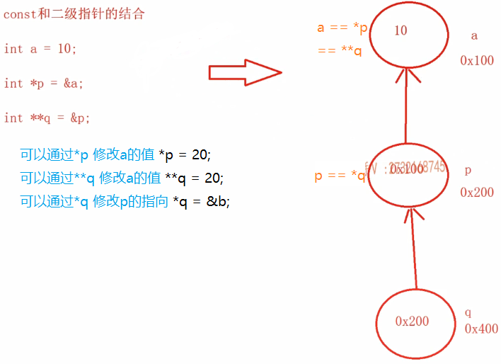

## 形参带默认值的函数

```cpp
int sum(int a, int b){}
ret = sum(a, b);
```

```cpp
int sum(int a, int b = 20){}
ret = sum(a);
```

```cpp
int sum(int a = 10, int b = 20){}
ret = sum();
```

如上，有2个形参，在调用时没有传递对应数量的实参，那么就是使用默认值

==**注意**==：形参给默认值的时候，只能从右向左，即`int sum(int a = 10, int b){}`，在编译时就会报错

```cpp
int main() {
    int a = 10;
    int b = 20;
    int ret = sum(a, b);
    /*
    mov eax, dword ptr[ebp - 8]
    push eax
    mov ecx, dword ptr[ebp - 4]
    push ecx
    // 从右向左压栈实参，先放入b，再放入a
    call sum
    */
}
```

如果在调用时，没有传实参，而是使用默认值，也会有压栈的操作，直接`push 默认值`。因此，使用默认值的函数，其效率比起不使用默认值（传递变量）是有提升的，少了的`mov`指令，同直接传入立即数是一样的

函数形参给默认值，可以在函数定义处，也可以在函数声明处。形参给默认值时，不管是定义时，还是声明时，形参默认值只能出现一次（哪怕值一样）


## `inline`内联函数

函数调用过程：

1. 从右向左将实参压栈

2. 然后执行`call`指令，先将`call`指令下一行的地址入栈

3. 进入被调函数中

4. 将调用它的函数地址入栈

5. 给被调函数开辟栈帧，并初始化

    linux下，gcc和g++只负责开辟栈帧，不对栈内存进行初始化

我们将函数的调用过程，称为函数调用的开销。如上`sum()`函数中，只是进行了`x +y`，对应到汇编就是`mov`和`add`指令，再加上一个`mov`进行返回结果。

而函数在调用的时候，实参压栈、栈帧开辟等指令远远多于上面处理逻辑的3条指令，因此，如果执行多次的`sum`操作，大量的时间都会花在函数调用的开销上

此时，就可以使用内联函数

```cpp
inline int sum(int x, int y) {
    return x + y;
}
```

==**内联函数**的处理过程：在编译过程中，就没有函数的调用开销了，在函数的调用点直接把函数的代码进行展开处理。因此**内联函数不再生成相应的函数符号**==

```cpp
int a = 10;
int b = 20;
int ret = sum(a, b); // 被内联函数直接展开为：int ret = a + b;
```

但是，不是所有的`inline`都会被编译器处理成内联函数，比如说递归函数。递归是自己调用自己，递归的深度只有在运行时根据递归的条件才能确定。`inline`是编译器处理，编译器是不执行指令的

所以，`inline`只是建议编译器把这个函数处理成内联函数，是由编译器决定的，而不是写了`inline`就一定内联。对于逻辑复杂庞大的函数，也不会处理成内联

而且，在debug版本上，inline也是不起作用的；只有在release版本下，才能出现

> 内联函数和普通函数的区别？

两者最大的区别就是，普通函数的调用有标准的开销

而内联函数是在编译节点，在函数的调用点，把函数的代码直接展开，从而省略了调用的开销

如果该函数在短时间内大量调用，而且该函数非常简单，应把此函数设置为内联函数

且，内联函数真的内联成功了，就不会在符号表中生成符号；而且内联函数只是一种对编译器的建议。可以通过`objdump -t main.o`来查看是否在符号表中生成符号，从而判断是否内联

> 普通函数的调用的开销：
>
> 1. **函数栈帧的创建与销毁**：
>
> 每次函数调用时，都会为该函数在调用栈中分配一个新的栈帧（stack frame）。栈帧的创建和销毁是函数调用过程中不可避免的开销，主要包括以下操作：
>
> - **保存返回地址**：当函数被调用时，程序需要保存调用函数后应当跳转到的地址，以便返回时能正确继续执行。这通常是由 CPU 自动完成。
> - **分配局部变量**：在栈帧中，为该函数的局部变量和参数分配内存。对于传递的参数（特别是按值传递），还需要将它们压入栈中。
> - **保存寄存器状态**：调用函数之前，保存一些寄存器的状态，以便在函数返回时恢复。
>
> 函数返回时，会销毁栈帧并恢复寄存器和调用环境，涉及以下步骤：
>
> - 恢复栈指针（指向上一个栈帧的地址）。
> - 恢复被保存的寄存器值。
> - 恢复程序计数器（PC，指向返回地址）。
>
> 影响：
>
> - 每次函数调用都会带来栈帧的创建与销毁，这会消耗时间。
> - 嵌套函数调用时，栈空间使用会增加，栈帧的管理开销随之增加。
>
> 2. **参数传递的开销**：
>
> 函数参数的传递方式有不同的方式，每种方式的开销不同：
>
> - **按值传递**：将参数的副本传递给函数。这会导致额外的内存复制开销，特别是对于较大的结构体或类对象时，会有较大的开销。
> - **按引用传递**：避免了复制副本，只是传递一个指针或引用。对于较大的对象或数据结构，按引用传递通常更高效。
> - **按指针传递**：与按引用类似，但需要额外的解引用操作。
>
> 对于**内联函数**，编译器会在编译时直接将函数的代码嵌入到调用处，这避免了参数传递和栈帧开销。
>
> 影响：
>
> - 按值传递大对象时的开销较高。
> - 按指针或引用传递更高效，但需要小心指针或引用的有效性。
>
> 3. **控制流跳转的开销**：
>
> 函数调用涉及到控制流的跳转，从当前函数跳转到被调用的函数，并在函数执行完毕后跳回原函数。控制流的跳转通常会造成 CPU 缓存失效（例如指令缓存失效），影响性能。
>
> 此外，跳转的代价还包括：
>
> - **函数入口与出口的指令**：进入函数需要执行一些指令来设置栈，离开函数需要清理栈。
> - **分支预测失败**：现代 CPU 会预测程序的分支（即控制流是否跳转），函数调用是一个常见的分支，跳转可能导致分支预测失败，增加额外的时间消耗。
>
> 4. **寄存器保存与恢复**：
>
> 许多处理器使用寄存器来快速执行计算和存储中间值，但在函数调用时，寄存器的值需要保存和恢复。具体的开销取决于调用约定和平台的实现。常见的调用约定包括：
>
> - **cdecl**（C 调用约定）
> - **stdcall**（Windows API 的调用约定）
> - **fastcall**（某些平台优化过的调用约定）
>
> 这些调用约定定义了哪些寄存器应该在函数调用前保存，以及哪些寄存器可以在函数内修改。
>
> 5. **函数返回值的处理**：
>
> 如果函数有返回值，处理返回值的过程也会带来开销：
>
> - **按值返回**：如果返回的对象较大或复杂（如大型结构体或类对象），会进行一次拷贝，这就会有额外的内存分配和复制开销。
> - **按引用或指针返回**：返回引用或指针不会产生内存拷贝，但需要处理引用的有效性（特别是返回局部变量的引用会导致悬空引用）。
>
> 6. **虚函数调用的额外开销**（如果是面向对象编程）：
>
> 如果函数是虚函数（通过多态机制调用），则函数调用的开销会更大。因为在运行时，编译器需要通过虚函数表（vtable）查找实际的函数实现，而不仅仅是直接跳转到函数的内存地址。这种机制会导致：
>
> - **vtable 查找的额外开销**：每次调用虚函数时，需要查找虚函数表，并通过虚函数表查找函数地址，这比普通的直接调用慢。
>
> 7. **内联函数的优化**：
>
> 内联函数（`inline`）通过将函数体直接嵌入调用代码中，可以避免调用开销。现代编译器在优化时会自动将一些小函数内联，减少栈帧管理和参数传递的开销。


## 函数重载

```cpp
bool compare(int a, int b) {
    cout << "compare_int_int\n";
    return a > b;
}
bool compare(double a, double b) {
    cout << "compare_double_double\n";
    return a > b;
}
bool compare(const char *a, const char *b) {
    cout << "compare_char*_char*\n";
    return a > b;
}

int main() {
    compare(10, 20);
    compare(10.0, 20.0);
    compare("aaa", "bbb");
}
```

在C++中可以定义函数名相同的函数。以上的代码就是函数重载的调用

### 什么是函数重载

一组函数，其中函数名相同，参数列表的个数或者类型不同，那么这一组函数就称作函数重载

重载函数的函数名相同，编译器在编译过程会根据函数调用时，传入的实参，来选择合适的函数重载的版本

**注意**：C语言不支持函数重载，编译不能通过

那么，==**为什么C++支持函数重载，而C语言不支持**==？

因为C++代码产生函数符号的时候，是由**函数名+参数列表类型**组成的；而C代码在产生函数符号的时候，符号只由函数名来决定，所以在C语言编译后生成的目标文件中，会找到多个相同的符号，从而产生链接错误。即编译器产生符号的规则不同

在C/C++中，函数只能定义一次，但是可以声明多次

```cpp
int main() {
    bool compare(int, int);
    compare(10, 20);
    compare(10.0, 20.0); // war: 精度丢失
    compare("aaa", "bbb"); // err: 无法转int
}
```

在上面的代码中，3次调用`compare`都会去调用`compare(int, int)`这个函数，因为这个函数声明在了与调用相同的作用域，因此在调用时，会优先找这个函数重载，如果想调用全局的，`::compare("aaa", "bbb")`

因此要保证函数重载有一个重要的==**前提**==，就是<u>这组不同版本的函数重载必须都处于同一个作用域</u>

```cpp
void func(int a) {}
void func(const int a) {} // error

int main() {
    int a = 10;
    const int b = 10;
    cout << typeif(a).name() << endl; // int
    cout << typeif(b).name() << endl; // int
}
```

对于编译器来说，上面2个函数定义是一样的，他们的形参都是`int`，产生的符号也是一样的，因此他们相当于是函数重定义了

```cpp
void func(int *a) {}
void func(const int *a) {} // ok
void func(int *const a) {} // error
```

- 当给参数使用`const`或`volatile`的时候，是怎么影响形参类型的？

> `volatile`关键字，它是一个标准的C/C++关键字，它在写多线程程序的时候是必不可少的，它是解决多线程程序内存可见性不可或缺的关键字

当给参数使用 `const` 或 `volatile` 时，影响的是指针本身、指针指向的内容，或两者。

1. **`const int *a`**：指针 `a` 可以指向不同的 `int`，但指向的内容不能被修改（即 `*a` 是常量）。这种方式用于不允许修改指针指向的值。
2. **`int *const a`**：指针 `a` 本身是常量，意味着不能改变指针指向的位置，但指向的内容是可以修改的。
3. **`const int *const a`**：指针 `a` 是常量，且指向的内容也是常量，既不能修改指针的指向，也不能修改指向的值。

`volatile` 关键字用于告诉编译器，不要对指针或变量进行优化，确保每次读取的值都是从内存中获取。`const` 和 `volatile` 可以组合使用来指定不同的行为，影响变量的可修改性和优化策略。

> - `const` 用来表示**不可修改**的数据：`const int* a` 不能修改指向的值，`int* const a` 不能修改指针本身。
> - `volatile` 用来表示**外部因素**可能修改数据：防止编译器优化对数据的访问，确保每次访问都从内存中读取。

- 一组函数，函数名相同，参数列表也想通，仅仅是返回值不同，则不能叫函数重载，返回值类型是否相同与函数重载没有任何关系

函数重载的主要原因就是，虽然看起来函数名相同，但是最终生成的符号不同，因为符号是函数名+形参列表类型的形式

什么是函数重载：==**函数重载指的是一组函数，函数名相同，参数列表不同，而且他们处在同一作用域**==，同时它也是静态（编译时期）多态的一部分

> 补充知识：==C++无法直接调用C代码==
>
> 假设存在一个sum.c，里面实现了`sum(int a, int b){}`这个函数，在C++文件中想要调用这个函数，在调用前先进行声明，`sum(int a, int b);`，在链接时会找不到对应的实现。
>
> 这是因为.c文件编译生成的该函数是C语言格式的符号，是`_sum`，而.cpp文件编译生成的函数声明的符号是`sum_int_int`，因此它是找不到对应的实现，其状态就是`UND`
>
> 因此如果想要正确使用，必须把C函数的声明括在extern "C"中，如下：
>
> ```cpp
> extern "C" {
>     int sum(int a, int b);
> } // 表示告诉C++编译器，这个函数是在C语言规则下生成的，不要按C++的规则来生成符号
> ```
>
> 反之，C无法调用C++的代码，也是同理，但是需要注意没有`extern "C++"`，C的编译器是无法识别这个的，而是在C++的代码中，使用`extern "C"{}`
>
> 在实际的业务代码中，一般是：
>
> ```cpp
> #ifdef __cplusplus
> extern "C" {
>     … …
> }
> ```
>
> `__cplusplus`是编译器内置的宏，即只要是C++编译器，都内置了这个宏


## `const`的用法

当一个变量被 `const` 修饰时，它的值不能被修改，即在初始化完成后，不能通过这个变量来修改它的值

```c
const int a; // 没初始化
```

在C语言中，上面的语句可以编译通过，只会有警告，说`a`没有被使用。

`const`修饰的变量，可以不同初始化，但是，这样就没有机会再给这个变量一个合法的值了，因为`const`修饰的量不能被修改

因此，在C语言中，`const`修饰的变量，并不叫常量，而是称为==**常变量**==，因此它不能作为常量表达式来使用

```c
const int a = 10;
int array[a] = {}; // error 无法作为常量使用

int *p = (int *)&a;
*p = 30;
printf("%d %d %d", a, *p, *(&a)); // 30 30 30
```

只是说`const`修饰的变量不能进行赋值，但并不意味着这个变量的内存不能修改。`const`只是语法上保证变量`a`不能在初始化后进行赋值修改，而这块内存则可以通过多种方式进行修改

```cpp
const int a;
```

在C++中，上面这条语句不能通过编译，报错`a`如果不是外部的，则必须初始化常量对象

因此，`const`必须初始化，叫做常量，因此也能够作为数组的下标来进行数组定义

```cpp
const int a = 10;
int array[a] = {}; // int array[20]

int *p = (int *)&a;
*p = 30;
printf("%d %d %d", a, *p, *(&a)); // 20 30 20
```

在C和C++中，`const`的编译方式不同：<u>**在C中，其当作一个变量来编译生成指令；在C++中，所有出现`const`常量名字的地方，都被常量的初始值替换了**</u>

因此对于上面一段的最后一段语句来说，变量`a`的值已经被修改了，而打印出这个结果则是因为`a`和`*(&a)`编译器在编译阶段就进行了替换，与`a`的内存并没有关系

这也是为什么在C++中`const`修饰的变量必须进行初始化的原因，不然怎么在编译阶段进行替换呢

```cpp
int b = 20;
const int a = b;
```

在上面的代码中，`a`就不是常量了，而是退化为了常变量，替换也是用`b`进行替换。因为初始值不是立即数，


## `const`的应用

在接收函数的返回值或是实参与形参的传递，都会使用到`const`

### `const`和一级指针的结合

`const int a = 10;`，在C++中，这是一个常量。`const`修饰的量，称为常量；和普通变量的区别，在C++中有两点区别：

- 编译方式不同：在编译过程中，所有出现常量标识符的地方，都会用其初值来替换
- 初始化完成后，不能作为左值

使用普通指针`int *p = &a;`是不能指向这个常量。如果可以的话，就能够通过没有任何修饰的指针变量`p`解引用去间接修改常量`a`的值了，那么`a`就不能称为常量了，即无法完成隐式类型转换`int *`$\Leftarrow\neq$`const int *`，不能试图把一个整型常量的地址赋值给另一个普通的指针

> `const`修饰的量，常出现的错误是：
>
> 1. 常量不能作为左值（编译器会直接报错） $\Longrightarrow$ 可以直接修改常量的值
> 2. 不能把常量的地址泄漏给一个普通的指针或者普通的引用变量（无法编译通过） $\Longrightarrow$ 可以间接修改常量的值

`const`和一级指针的结合有两种情况，一种是`const`修饰指针的指向；另一种是`const`修饰指针本身

==**在C++的语法规范上规定，`const`修饰的是离它<u>最近的类型</u>**==

- ```cpp
    const int *p; // const 修饰 int，*p 不能再赋值
    ```

    这是指向常量的指针(const to point)，通过指针可以指向任意不同int类型的内存(`p = &b` ✔)，但是不能通过指针解引用来修改这块内存的值(`*p = 20` ✘)

- ```cpp
    int const *p; // const 修饰的还是int，注意是类型！，*不是类型，同上
    ```

- ```cpp
    int *const p; // const 修饰的是int *，*不可能单独作为类型，所以是int *	
    ```

    这是常量指针(const point)，这个指针p是常量，不能指向其他内存(`p = &b` ✘)，但是可以通过指针解引用修改指向内存的值(`*p = 20` ✔)	
    即p变量本身就是常量，因此不能修改，即初始化时指向哪块内存，就永远指向那块内存，但是\*p没有被const修饰，因此它能够被修改

- ```cpp
    const int *const p;// 前const 修饰 int*, 后const 修饰p本身
    ```

    前面的const让指针不能指向其他内存，后面的const让指针不能通过解引用来修改这块内存的值

一般把`const`写到类型的左边

==**总结**==：两种情况的区别就是 `const` 修饰的位置决定了它修饰的是指针本身还是指向的对象

- `const int* p;` 是 **指向常量的指针**，即你不能通过 `p` 修改 `*p` 的值，但 `p` 可以指向其他地方。
- `int* const p;` 是 **常量指针**，即不能修改 `p` 本身的值（不能让它指向其他地方），但可以修改 `*p` 指向的值。

因此`const int a = 10`，不使用`int *p = &a`，而是应该使用`const int *p = &a`，让指针不能解引用；而`int *const p`还是可以通过解引用赋值

> <u>总结`const`和指针的类型转换公式</u>：
>
> - `int *`$\Leftarrow$`const int *` 这个转换是==错误==的
>
> - `const int *`$\Leftarrow$`int *` 这个转换是可以的
>
> - `int *const`$\Leftarrow$`int *`这个转换也是可以的
>
>     ==const如果右边没有指针*，cosnt是不参与类型的==，const只是表示当前的变量是常量，不能作为左值：`int *const q = nullptr; cout << typeid(q).name()` $\Longrightarrow$`int *`；而`const int *p = nullptr; cout << typeid(p).name()`$\Longrightarrow$`int const *`

经典面试题：

`p`放的是`a`的地址，那么将`p`赋值给`q`是不是相当于把`a`的地址也放入`q`中？那么`a`是个普通的变量，值可以修改，那么最后一条指令为什么错误？用普通的指针`q`指向`a`的地址没有任何错误啊？

```cpp
int a = 10;
const int *p = &a;
int *q = p; // error ?
```

这是一个坑，与`a`无关，最后一行的类型转换就是错误的！`p`是`const int *`类型，怎么能够直接转换为`int *`呢？

不管是把一个变量的地址给到`p`还是把一个常量的地址给到`p`，对于编译器来说，它永远认为`p`里面放的是整型常量的地址


### `const`和二级（多级）指针的结合

```cpp
int a = 10;
int *p = &a;
int **q = &p;
```

以上是一段经典的一级指针指向普通变量，二级指针指向一级指针的表达式

如果，将二级指针变为`const int **q = &p`，表达式是还正确吗？

首先，明确`&p`的类型是`int **`，左边的类型是`const int **`。

进行分析：`const`是参与的，因为其右边是指针



`const`和二级指针的结合，看二级指针的表达式，无非也只有`q`（表示这块内存本身的值，`0x200`）、`*q`（表示指向的一级指针中内存的值，`0x100`）、`**q`（表示指向的一级指针指向的变量的值，`10`）这3种，**那么，`const`和二级指针的结合也就有3种方式**：

> ==**在C++的语法规范上规定，`const`修饰的是离它<u>最近的类型</u>**==

- ```cpp
    const int **q;
    ```

    这个声明中，`const`最近的类型是`int`，所以它修饰的表达式是`**q`，即`**q`不能被赋值；但是`*q`是可以赋值的，`q`本身也是可以被赋值的。

    ```cpp
    const int x = 10;
    const int y = 20;
    const int *p = &x;
    const int **q = &p;
    
    *q = &y;  // OK：可以修改 `*q` 的值，使 `p` 指向 `y`。
    *p = 30;  // err：不能通过 `p` 修改 `y` 的值，因为 `*p` 是 `const int`。
    ```

- ```cpp
    int *const *q;
    ```

    这个声明中，`const`最近的类型是`int*`，所以`const`修饰的表达式是`*q`，即`*q`不能被赋值；但是`**q`和`q`本身是可以被赋值的

    即`*q` 是只读的，不能通过 `*q` 修改它指向的指针；但是可以通过 `**q` 修改最终目标值

    ```cpp
    int x = 10;
    int y = 20;
    int *const p = &x;  // `p` 是指向 `x` 的常量指针。
    int *const *q = &p; // `q` 是指向常量指针的二级指针。
    
    *q = &y;  // 错误：不能修改 `*q`，因为它是一个 `const int *`。
    **q = 30; // OK：可以通过 `**q` 修改 `x` 的值。
    ```

- ```cpp
    int **const q;
    ```

    这个声明中，`const`最近的类型是`int**`，所以`const`修饰的表达式是`q`，即`q`不能被赋值；但是`**q`和`*q`是可以被赋值的

    即，`const` 修饰 `q` 本身，表示`q` 是只读的，不能通过 `q` 修改它的指向；但可以通过 `*q` 和 `**q` 修改目标值或目标指针

    ```cpp
    int x = 10;
    int y = 20;
    int *p = &x;
    int **const q = &p; // `q` 是一个常量指针，不能改变指向。
    
    *q = &y;   // OK：可以通过 `*q` 修改 `p` 的指向。
    **q = 30;  // OK：可以通过 `**q` 修改最终目标值。
    q = &p;    // 错误：不能修改 `q` 的指向。
    ```

==**总结**==：

| 声明            | 修改最终目标值 | 修改中间一级指针 | 修改二级指针本身 |
| --------------- | -------------- | ---------------- | ---------------- |
| `const int **q` | ❌              | ✅                | ✅                |
| `int *const *q` | ✅              | ❌                | ✅                |
| `int **const q` | ✅              | ✅                | ❌                |

> <u>总结`const`和指针的类型转换公式</u>：
>
> - `int **`$\Leftarrow$`const int **` 这个转换是==错误==的
>
> - `const int **`$\Leftarrow$`int **` 这个转换也是==错误==的
>
> `const`和多级指针结合的时候，`=`两边必须都有`const`或都没有`const`
>
> - `int **`$\Leftarrow$`int *const*` 这个转换是`const`和一级指针的结合，相当于`*`$\Leftarrow$`const*` ，是==错误==的
> - `int *const*`$\Leftarrow$`int **` 这个转换是`const`和一级指针的结合，相当于`const*`$\Leftarrow$`*` ，是可以的

### 面试题

**1. 请选择下面哪些代码是错误的**

A. 

```cpp
int a = 10;
const int *p = &a;
int *q = p;
```

B.

```cpp
int a = 10;
int *const p = &a;
int *q = p;
```

这里`const`右边没有指针，所以`const`不参与类型，第二条语句中左边的表达式`p`的类型是`int *`，因此能够赋值给`int *q`，这是正确的

C. 

```cpp
int a = 10;
int *const p = &a;
int *const q = p;
```

D. 

```cpp
int a = 10;
int *const p = &a;
const int *q = p;
```

和B同理

答案：A，B，D ❌

正确答案：A


**2. 请选择下面哪些代码是错误的**

A. 

```cpp
int a = 10;
int *p = &a;
const int **q = &p;
```

`const`修饰的是`**q`，即a的值不能修改，而p能够通过`*p`修改，因此错误

B.

```cpp
int a = 10;
int *p = &a;
int *const* q = &p;
```

C. 

```cpp
int a = 10;
int *p = &a;
int **const q = &p;
```

D. 

```cpp
int a = 10;
int *const p = &a;
int **q = &p;
```

第二条语句中，`const`右边没有指针，可以等价于`int *p = &a`，而第三条语句中`&p`的类型是`int *const *`，由于p取了地址，因此`const`不能忽略，常量不能赋值给非常量的左值

E. 

```cpp
int a = 10;
const int *p = &a;
int *const* q = &p;
```

这里`&p`的类型是`const int **`，其中`const`修饰的`**`即`a`的值无法修改，而`int *const*`，修饰的是`*q`，即一级指针的指向无法修改，因此类型不匹配，错

答案：E ❌

正确答案：A，D，E


## C++的引用

### 引用

引用是一种更安全的指针

因为在使用引用的时候，可以保证它一定会引用一块内存；而指针则有可能是野指针，或者是空指针

```cpp
int a = 10;
int *p = &a; // 用指针指向a内存，因为指针有自己单独的内存，所以需要取a的地址
	// eax, [a]
	// dword ptr [p], eax
int &r = a; // 直接指定引用的内存
	// eax, [a]
	// dword ptr [b], eax

*p = 20; 
	// eax, dword ptr [p]
	// dword ptr [eax], 14h
// a = 20, *p = 20, b = 20
b = 30; 
	// eax, dword ptr [b]
	// dword ptr [eax], 1Eh
// a = 30, *p = 30, b = 30
// 说明a, *p, b 都表示同一块内存
```

引用和指针的区别：

- 引用必须初始化，而指针可以不初始化

    `int *p = nullptr;`是可以的；而引用不能指定一个引用变量而不指定它所引用的变量

- <u>从汇编的角度看，定义一个指针和定义一个引用是一模一样的，通过指针解引用来修改指向的内存和通过引用变量修改引用内存的值，也是一模一样的</u>。因此指令在汇编层面，没有引用和指针之分，都是通过地址的操作来进行的，即对于指针或引用，底层都是通过指针的方式来处理的

    如果用引用，它是一种更安全的指针，定义引用变量，在指令上也是在定义个指针，给引用变量赋值，会自动做一个指针的解引操作，相当于不是给这个引用变量赋值，而是给这个引用变量引用的对象进行赋值

- 在定义引用变量的时候，首先要进行初始化，并且这个初始化的对象一定要能够取地址。因为在指令上生成的时候，是将右边这个所引用的值的地址拿出来，放到底层的指针内存中；通过引用变量赋值的时候，也是从底层的指针中取出地址再做地址解引用，赋值

    ```cpp
    int &c = 20; // error
    ```

- 引用只有一级引用，没有多级引用；而指针可以有一级指针，也可以有多级指针

引用的好处：

- 简单、安全

```cpp
void swap(int *x, int *y) {
    int tmp = *x;
    *x = *y;
    *y = tmp;
} // swap(&a, &b);
void swap(int &x, int &y) {
    int tmp = x; // 会默认对x进行解引用
    x = y;
    y = tmp;
} // swap(a, b) // 传递的还是地址
```

上面的2段代码，从汇编的层面来说没有区别

```cpp
int arr[5] = {};
	// sizeof(arr) = 20;
int *p = arr;
	// sizeof(p) = 8; // 64位OS

// 定义一个引用变量，来引用array，可以借助指针推导
int (*p)[5] = &array;
	// sizeof(q) = 20; 
```

引用，通俗来说是其引用内存的别名，所以`sizeof(q)`就是`sizeof(arr)`。从指令的角度来说，当使用引用变量的时候，总是会做一个解引用的操作


### 左值引用和右值引用

**左值**：左值是指**可以被标识和定位的内存对象**，简单来说，左值就是**指向特定内存位置的表达式**，它是持久存在的，允许对其取地址（`&`操作符）。

- 左值具有持久的内存存储。
- 可以出现在赋值表达式的左侧，也可以出现在右侧。
- 左值通常是变量或能够返回变量引用的表达式。

**右值**：右值是**不与内存地址关联的临时值或常量值**，它是用来表达某个具体值或某种临时计算结果

- 通常只能出现在赋值表达式的右侧。
- 无法对右值取地址。
- 右值的生命周期通常是短暂的，只有在表达式计算期间存在。

```cpp
int &c = 20; // error
int &&cc = 20; // OK 用右值引用 引用右值
	// dword ptr [ebp - 30h], 14h 将20放到一段临时内存中
	// eax, [ebp - 30] 将临时内存的地址放入寄存器
	// dword ptr [c], eax 在将该寄存器中的内容放到c的指针变量中

const int &d = 20; // ok
	// 其本质是产生一个临时量存储20，然后把临时量的地址放入d指针中
```

右值引用和常引用在底层的汇编指针和上面的右值引用一模一样，唯一的不同是常引用无法修改变量的值

```cpp
d = 40; // error
c = 30; // ok
```

对于右值引用变量本身，也就是上的`cc`，它是一个左值，有内存有名字

右值引用就是用来引用右值，对于左值变量不能用右值引用来引用

总结：

- ==右值引用，专门用来应用右值类型，在指令上，可以自动产生临时量，然后直接引用临时量；==

- ==右值引用变量本身是一个左值，只能用左值引用来引用它；==
- ==不能用一个右值引用变量，来引用一个左值==


### 引用的应用

例题：写一段代码，在内存的`0x0018ff44`处写一个4字节的10

```cpp
// 定义指针并将其指向0x0018ff44地址
int* ptr = reinterpret_cast<int*>(0x0018ff44);
    
// 将4字节的值10写入该地址
*ptr = 10;
```

`reinterpret_cast`用于强制转换将`0x0018ff44`（一个内存地址）转换为指向`int`类型的指针。如果不进行强转，编译器会将该地址当成整数。`int`在大多数系统上占4个字节，因此这会让指针指向一个4字节的区域。

对于指针，也可以定义引用变量

```cpp
int *&&p = (int *)0x0018ff44; // 类型是int*, &&修饰p表示它是引用，右值引用变量
// 因为右边的(int *)0x0018ff44已经是一个地址，是一个右值

// 这么写也可以
int *const &p = (int *)0x0018ff44; // 让这个引用变量作为常量
const int *&p = // err，const修饰的是*p,即p的指向不能修改，而这样需要的是地址的内容不能改变
```

同理

```cpp
int a = 10;
int *p = &a;
int **q = &p; ==> int *&q = p;
```

因此，如果要求判断

```cpp
const int *&q = p; // 对错与否
===> 可以将引用还原成指针来考虑
const int **q = &p; // 转成这种形式 ==> err: &p是int *类型，不能赋值非一个const int*
```

`&`是不参与类型的，`typeid(q).name()`

**面试题**：请判断下面哪些代码是错误的？

A. 

```cpp
int a = 10;
int *p = &a;
int *&q = p;
```

B.

```cpp
int a = 10;
int *const p = &a;
int *&q = p;
```

`const`修饰p，那么最后一句等价于`int **q = &p`是将一个常量的地址暴露给了普通的引用变量，一旦对`*q`赋值，就修改了常量p的值

C.

```cpp
int a = 10;
const int *p = &a;
int *&q = p;
```

D. 

```cpp
int a = 10;
int *p = &a;
const int *&q = p;
```

答案：B、C、D


## C++的`new`和`delete`

### `malloc`

在C语言中

```cpp
int *p = (int *)malloc(sizeof(int));
if (p == nullptr)
    return -1;
*p = 20;
free(p);
```

`malloc`和`free`都称作C的库函数

`malloc`内存开辟失败，是通过返回值和空指针进行比较

`malloc`是按照字节开辟内存的，返回值是`void*`类型，因此需要对返回类型进行强转

​	它只管开辟内存，不管初始化，需要手动地进行初始化的操作

释放这块内存的时候，只需要调用`free`函数，并将这块内存的起始地址传入即可


### `new`

在C++中

```cpp
try {
    int *p = new int(20);
} catch (const bad_alloc &e) {
    
}
delete p;
```

`new`和`delete`称作运算符

直接在`new`后面指定类型，说明在堆上开辟一个什么类型变量的内存，并且可以使用`()`来指定初始值。所以它不需要进行类型强转

即，`new`不仅可以做内存开辟，还可以做内存初始化操作

`new`开辟内存失败，是通过抛出`bad_alloc`类型的异常来判断的


### 开辟数组类型

```cpp
int *q = (int *)malloc(sizeof(int) * 20); //还是按字节来开辟的
if (q == nullptr)
    return -1;
free(q);

int *qq = new int[20]; // 20个int，sizeof(int)
// 这样堆上只开辟数组，数组的元素不会进行初始化
// int *qq = new int[20](); 将数组的所有元素初始化为0
delete[] qq;
```

`free`不管是释放单个内存，还是释放数组内存，就是函数调用，只需要传入内存的起始地址即可

`delete`在释放单个元素内存和释放数组内存的时候，存在`[]`的区别


### `new`有多少种

```cpp
int *p1 = new int(20);
int *p2 = new (nothrow) int; // 开辟失败不会抛出异常，和malloc一样来判断失败
const int *p3 = new const int(40); // 在堆上开辟了一个常量，常量内存，并初始为40
// 定位new，在后面容器的空间配置器的讲
int data = 0;
int *p4 = new (&data) int(50); // 在指定地址的内存上，划分4byte,并填入初值50
```

